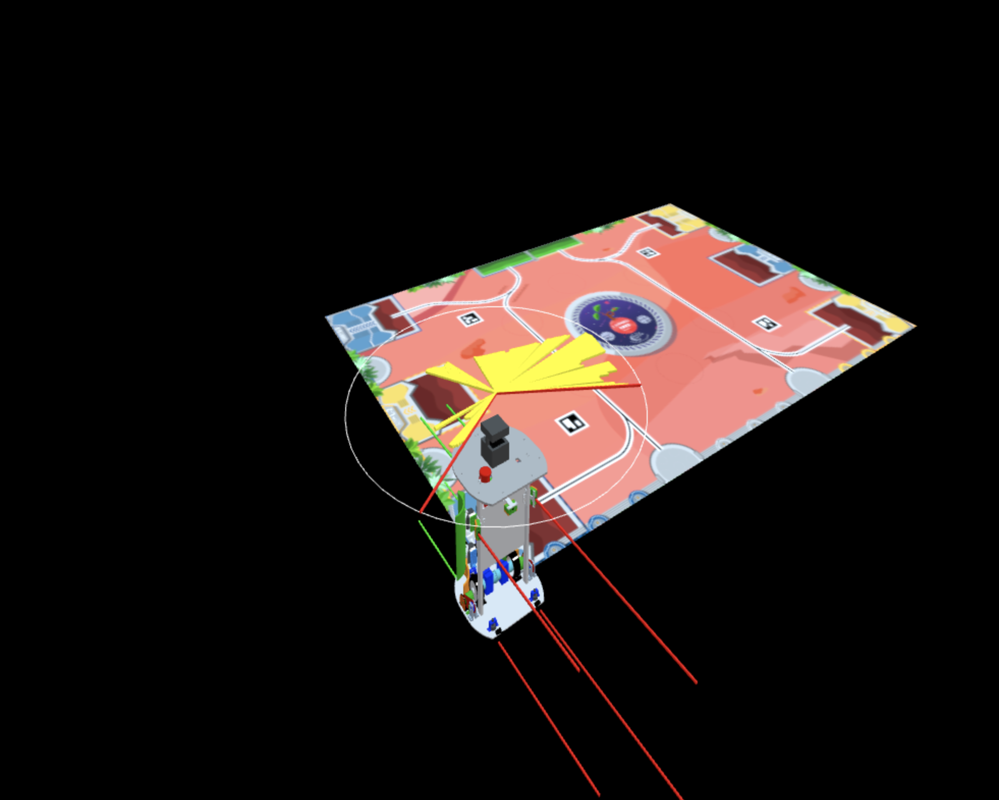

# Sensors output



### requirements

-   install Nodejs
-   run py-robot-controller

py-robot-controller is not strictly necessary for local development

### usage

```bash
npm install
npm run dev
```
